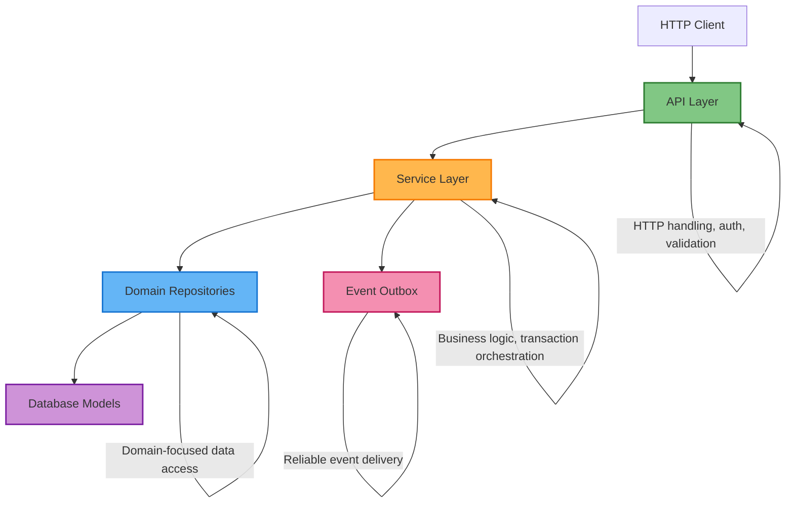
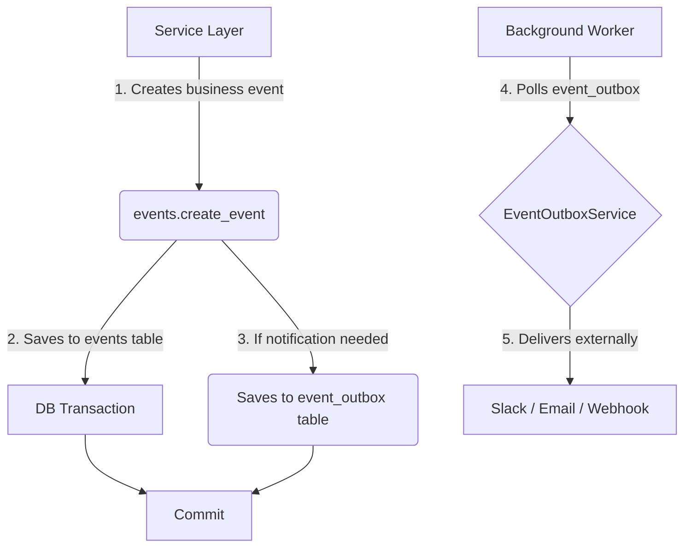

# Service Layer Architecture

## Overview

The Huey Books API uses domain-oriented repositories, a service layer for business logic, and an outbox for reliable event delivery. This document defines layer responsibilities and representative implementations. Legacy paths are being migrated incrementally; examples are not an exhaustive inventory or evidence of deployment.

### Layer Responsibilities



**Representative services:**

| Service | File | Role |
|---------|------|------|
| `AnalyticsService` | `app/services/analytics.py` | Read-only analytics and reporting |
| `CMSWorkflowService` | `app/services/cms_workflow.py` | CMS publishing, bulk ops, validation |
| `ConversationService` | `app/services/conversation_service.py` | Chat session lifecycle management |
| `FlowService` | `app/services/flow_service.py` | Flow CRUD, node/connection management |
| `CollectionService` | `app/services/collection_service.py` | Library collection operations |
| `BookListService` | `app/services/booklist_service.py` | Booklist management |
| `ConcurrencyControlService` | `app/services/concurrency_service.py` | Advisory locks, revision control |
| `EventOutboxService` | `app/services/event_outbox_service.py` | Reliable event delivery with retry |
| `ExecutionTraceService` | `app/services/execution_trace.py` | Chat flow execution tracing |
| `FlowWebhookService` | `app/services/flow_webhook_service.py` | Webhook delivery for flow events |
| `SlackNotificationService` | `app/services/slack_notification.py` | Slack alerts via event outbox |
| `EmailNotificationService` | `app/services/email_notification.py` | Email via event outbox |
| `CloudTasksService` | `app/services/cloud_tasks.py` | GCP Cloud Tasks integration |

---

## Domain Repository Architecture

### Repository Pattern

New data access belongs in domain-oriented repositories in `app/repositories/`.
Existing repositories use a mixture of concrete classes, functions, ABCs and
Protocols; legacy API/service queries remain to be migrated. A repository does
not commit: its caller owns the transaction. See [architecture contracts](architecture-alignment.md)
for the organisation workspace and remaining compatibility work.

**Representative repositories** (see `app/repositories/` for the complete set):

| Repository | Domain |
|-----------|--------|
| `AuthorRepository` | Authors |
| `BooklistRepository` | Booklists |
| `ChatRepository` | Chat sessions and interactions |
| `ClassGroupRepository` | Class groups |
| `CMSRepository` | CMS content and variants |
| `CollectionRepository` | Library collections |
| `CollectionItemActivityRepository` | Collection item tracking |
| `ConversationRepository` | Conversation sessions |
| `EditionRepository` | Book editions |
| `EventRepository` | Application events |
| `FlowRepository` | Flow definitions, nodes, connections |
| `IllustratorRepository` | Illustrators |
| `LabelsetRepository` | Book label sets |
| `OrganisationRepository` | Organisation workspace discovery, membership and holdings |
| `ProductRepository` | Stripe products |
| `SchoolRepository` | Schools |
| `ServiceAccountRepository` | Service account tokens |
| `SubscriptionRepository` | Stripe subscriptions |
| `WorkRepository` | Book works |

Protocol interfaces are defined in `app/repositories/protocols.py`.

### Remaining Legacy CRUD

Legacy entry points in `app/crud/` need consumer-by-consumer migration:

| File | Compatibility responsibility |
|------|----------------------------|
| `base.py` | Shared base class and utilities |
| `cms.py` | CMS operations, partly delegated to CMSRepository |
| `collection.py` | Collection operations |
| `event.py` | Application events |
| `user.py` | Polymorphic account operations, including authentication consumers |

The `crud/__init__.py` re-exports `ChatRepository` from `app/repositories/` for backward compatibility.

---

## Declarative Database Infrastructure

PostgreSQL functions, triggers, views and extensions are defined as Python
objects using `alembic_utils` and registered in `alembic/env.py`
(`register_entities`), providing version control and a single source of truth
for database logic.

**Key files:**
- `app/db/functions.py` — PGFunction definitions
- `app/db/triggers.py` — PGTrigger definitions
- `app/db/views.py` — PGView / PGMaterializedView definitions
- `app/db/extensions.py` — PGExtension definitions (`vector`, `pg_trgm`)

> **Scope note:** `alembic_utils` manages *stateful SQL objects* — functions,
> triggers, views, extensions. Plain schema (tables, columns, indexes) is
> handled by ordinary Alembic migrations generated from the SQLAlchemy models.
> A functional index like the trigram GIN index on `lower(schools.name)` is a
> model `Index` with a labelled expression and PostgreSQL operator class, while the
> `pg_trgm` extension it depends on is declared in `app/db/extensions.py`.
> Generated revisions freeze their definitions; they must not import these live
> application declarations. Do not edit an applied migration to change behaviour.

**Example** (CMS full-text search trigger):

```python
# app/db/functions.py
cms_content_tsvector_update = PGFunction(
    schema="public",
    signature="cms_content_tsvector_update()",
    definition="""returns trigger LANGUAGE plpgsql
      AS $function$
        BEGIN
            NEW.search_document := to_tsvector(
                'english',
                coalesce(NEW.content->>'text','') || ' ' ||
                coalesce(NEW.content->>'setup','') || ' ' ||
                coalesce(NEW.content->>'question','') || ' ' ||
                coalesce(array_to_string(NEW.tags, ' '), '')
            );
            RETURN NEW;
        END;
      $function$
    """
)

# app/db/triggers.py
cms_content_tsvector_trigger = PGTrigger(
    schema="public",
    signature="trg_cms_content_tsvector_update",
    on_entity="public.cms_content",
    is_constraint=False,
    definition=(
        "BEFORE INSERT OR UPDATE ON public.cms_content FOR EACH ROW EXECUTE FUNCTION "
        f"{cms_content_tsvector_update.signature}"
    )
)
```

**Current implementations:**

| Object | Purpose | Status |
|--------|---------|--------|
| `cms_content_tsvector_update` | Full-text search maintenance | Live |
| `notify_flow_event` | Event notifications via NOTIFY | Live |
| `update_edition_title` | Computed field updates | Live |
| `update_edition_title_from_work` | Cascading title updates | Live |
| `update_collections_function` | Collection aggregation | Live |
| `cms_content_tsvector_trigger` | FTS trigger on `cms_content` | Live |
| `conversation_sessions_notify_flow_event_trigger` | Event trigger on sessions | Live |
| `update_collections_trigger` | Collection update trigger | Live |
| `pgvector_ex` (`vector`) | Embedding storage | Declared |
| `pg_trgm_ex` (`pg_trgm`) | Trigram / fuzzy search | Live |
| `recommendable_editions` (MV) | Pre-computed recommendation candidates | Live |
| `refresh_recommendable_editions_function` | Non-blocking MV refresh | Live |

Migrations use `op.create_entity()` / `op.drop_entity()` for these objects.
The `pg_trgm` extension is also created idempotently in its migration
(`CREATE EXTENSION IF NOT EXISTS pg_trgm`) so the trigram index can be built in
the same revision.

---

## Recommendation Engine

### Materialized View: `recommendable_editions`

Defined in `app/db/views.py` as a `PGMaterializedView`. One row per recommendable
work, pre-joining the latest labelset, one cover edition (LATERAL LIMIT 1 on
`cover_url IS NOT NULL`), and aggregated hue/reading-ability key arrays.

**Columns**: `work_id` (unique), `labelset_id`, `min_age`, `max_age`,
`recommend_status`, `cover_edition_isbn`, `cover_url`, `hue_keys text[]`,
`reading_ability_keys text[]`.

**Indexes**:
- `uix_recommendable_editions_work_id` — unique on `work_id` (required for
  `REFRESH CONCURRENTLY`; also backs `work_id` lookups in the query)
- `ix_recommendable_editions_hue_keys` — GIN index for `hue_keys && :hues`
- `ix_recommendable_editions_reading_ability_keys` — GIN index for array overlap
- `ix_recommendable_editions_status_ages` — btree on `(recommend_status, min_age, max_age)`

### Scored Recommendation Query

`app/services/recommendations.py::get_recommended_editions_from_mv` issues a
single query over the MV with a scoring expression:

| Criterion | Weight | Notes |
|-----------|--------|-------|
| School-collection membership | 4 | EXISTS sub-query against `collection_items` |
| Reading-ability overlap | 2 | `reading_ability_keys && :ra_arr` |
| Hue overlap | 1 | `hue_keys && :hue_arr` |

`ORDER BY score DESC, random()` gives graceful degradation in one pass: best
matches appear first, with random ordering within each score tier. The indexed
MV allows fallback ranking in one query rather than sequential retries against
the live join graph. Measure latency with representative data and concurrency;
the query shape alone does not guarantee a response time.

### Candidate Hydration

Candidate hydration belongs to `RecommendationRepository.load_ranked_candidates`.
It preserves ranked order and loads the response's authors, hues, reading abilities
and title fallback explicitly. Collection membership/counts and illustrators are
not response fields and are not loaded. These query-local loader options do not
change model defaults or the caller's transaction. Missing candidate records are
skipped, allowing for a materialized view that has not yet refreshed.

### Refresh Strategy

**Weekly**: `POST /v1/maintenance/refresh-recommendations` on the internal API,
invoked by Cloud Scheduler (OIDC auth via the background-tasks service account).
The endpoint calls `SELECT refresh_recommendable_editions_function()` which runs
`REFRESH MATERIALIZED VIEW CONCURRENTLY recommendable_editions`. CONCURRENTLY
avoids an `ACCESS EXCLUSIVE` lock so recommendation reads continue uninterrupted
during the refresh (it requires the unique index on `work_id` and an
already-populated view, both of which hold here).

The schedule, timezone, retry policy and OIDC configuration belong to
`hardbyte-iac/cloudscheduler_refresh_recommendations.tf`; inspect that manifest
and the deployed job when verifying refresh behaviour.

**Debounced on-write**: After a label mutation, the endpoint enqueues a Cloud
Tasks job named `refresh-recommendable-editions` via
`enqueue_debounced_mv_refresh()` in `app/services/recommendations.py`. The
wired callers are:
- `PATCH /labelsets` (bulk patch) — `app/api/labelset.py`
- `PATCH /work/{work_id}` when the change includes labelset edits — `app/api/works.py`
- `POST /work/{work_id}/reviews` when the review is *promoted* to the canonical
  labelset (Wriveted staff or educators) — `app/api/reviews.py`. Non-promoting
  reviews (e.g. from students) leave the labelset untouched and skip the refresh.

Named tasks are deduplicated by GCP within a ~4-hour window, so a burst of writes
collapses into a refresh scheduled ~60 s after the first accepted enqueue, not
the last write. Later writes do not reschedule it and may wait for the periodic
refresh. The function is a no-op when Cloud Tasks is not configured (local dev /
tests unaffected).

---

## Event Systems

The codebase has **three distinct event systems** serving different purposes:



### 1. Application Events (Original)

- **Files**: `app/crud/event.py`, `app/services/events.py`, `app/models/event.py`
- **Purpose**: Editorial/domain activity and notifications; not high-volume telemetry
- **Storage**: `events` table
- **Delivery**: Direct Slack API calls, or via Event Outbox for reliability

#### Flow-Driven Events (`emit_event` action)

Chat flows can create application events via the `emit_event` action type (see `ActionNodeProcessor._handle_emit_event`). These events are written with `commit=False` into the same database transaction as session state updates, ensuring atomicity — if the session update rolls back, the event is also discarded. This avoids orphaned analytics records.

The `iterate_over` option creates one event per item in a list variable, useful for recording per-book or per-recommendation events without separate action nodes.

### 2. Chat Flow Events (Real-time)

- **Files**: `app/services/event_listener.py`, database triggers (`notify_flow_event`)
- **Purpose**: Real-time chat session state changes for dashboard feedback
- **Mechanism**: PostgreSQL NOTIFY/LISTEN for immediate updates
- **Events**: `session_started`, `node_changed`, `session_completed`

### 3. Event Outbox (Reliable Delivery)

- **Files**: `app/models/event_outbox.py`, `app/services/event_outbox_service.py`
- **Purpose**: Durable delivery attempts with retries and dead-letter handling; consumers must tolerate duplicates
- **Storage**: `event_outbox` table with status tracking, retry count, dead letter queue
- **Delivery**: Background processing with exponential backoff
- **Channels**: Webhook, Slack, email, internal processing
- **Usage**: Active in CMS, Flow, and Conversation domains

The Event Outbox writes happen within the same database transaction as business data, ensuring atomicity. NOTIFY/LISTEN is preserved for low-latency dashboard updates where durability is not critical.

Operational instrumentation uses OpenTelemetry; see the
[observability design](observability-architecture.md). Product observations and
retained reporting follow the [analytics proposal](analytics-proposal.md).
Neither telemetry nor sampled traces replace transactional facts. Session replay
is a separate PostgreSQL support feature, not Cloud Trace data.

---

## Concurrency Control

Session state modifications use PostgreSQL advisory locks combined with revision control to prevent lost updates.

**Problem**: Multiple writers (user API requests, background timeouts, webhook callbacks) can race on the same session.

**Solution** (implemented in `app/services/concurrency_service.py`):

1. **Per-session advisory locks**: `pg_try_advisory_xact_lock(hash(session_id))` scopes locks to individual sessions
2. **Revision control**: Every mutation increments a revision number; updates include `WHERE revision = :expected` to detect conflicts
3. **Conflict resolution**: User interactions retry once on conflict; background tasks abort gracefully

---

## Flow Storage Strategy

- **Canonical source**: Normalized tables (`flow_nodes`, `flow_connections`) are the system of record, used by runtime and analytics.
- **JSON snapshot**: `flow_definitions.flow_data` stores an import/export-friendly snapshot (nodes, connections, variables). Services regenerate this after structural edits for API responses and caching.
- **Importing**: API accepts `flow_data` on creation and materializes into normalized tables (with safe enum mapping; unknown connection types fall back to `DEFAULT` while preserving conditions).
- **Publishing**: Updates the published version and snapshots the current `flow_data`.

---

## Transactions & Events

- **Ownership**: Services own transaction boundaries. Repositories persist and flush; they do not commit.
- **Pattern**: The service coordinates repository writes and any required outbox events, then commits once.
- **Outbox**: `EventOutboxService.publish_event` enqueues events within the same SQLAlchemy session so the commit includes both business data and the event row.
- **Snapshots**: Snapshot materialization/regeneration is orchestrated by services to keep repositories side-effect free; builders perform `flush` only.

### Flow Service

- `FlowService` is the canonical write/read surface for flow operations (create/update/clone/publish, node and connection CRUD).
- All flow node/connection endpoints route through `FlowService`.
- Structural writes regenerate snapshots through the shared builder within the
  service transaction. A regeneration operation also repairs existing snapshots.

### Label reviews

`ReviewService.submit` owns labelset creation, confirmation validation, review
assessment and canonical promotion in one transaction. The HTTP adapter maps
domain errors and schedules recommendation refresh only after a successful commit.
The labelset repository locks the owning work before first creation and reloads
locked canonical labels before any authority-based patch. Confirmation uses the
repository-loaded snapshot; an unchanged multi-level confirmation preserves the
existing reading levels and their provenance. Educator reviews preserve the
staff-checked flag and cannot override higher-authority HUMAN labels.

---

## Incremental migration

Move legacy persistence behind domain repositories as the relevant workflows are
changed. Route adapters should delegate policy and transaction orchestration to
services, not merely replace CRUD imports with direct repository calls. Preserve
polymorphic account behaviour, permission checks and request isolation during
the transition. Proposed changes such as Unit of Work adoption belong in the
[architecture roadmap](architecture-roadmap.md), not the required contract.

### Migration Workflow

When migrating a domain from CRUD to repository pattern:

1. **Analyze** the existing CRUD file (operations, method signatures, dependencies)
2. **Create repository** in `app/repositories/{domain}_repository.py`; introduce an ABC or Protocol when it provides a useful substitution boundary, not as boilerplate
3. **Update consumers** through the appropriate service boundary, preserving caller-owned transactions
4. **Handle circular imports** using one of three proven patterns:
   - Replace CRUD imports with repository imports
   - Extract shared utilities to `app/utils/` (e.g., `dict_utils.py`)
   - Use function-level local imports
5. **Delete the CRUD file** once all consumers are migrated
6. **Run full test suite** via `bash scripts/integration-tests.sh`

---

## Design Principles

These principles guide architectural decisions:

1. **Single Responsibility**: Each service handles one domain
2. **Dependency Injection**: Services receive dependencies via constructor
3. **Domain Exceptions**: Services raise domain-specific exceptions, never HTTP status codes
4. **Transaction Ownership**: The service coordinating a write owns its commit/rollback boundary; collaborating methods share that transaction
5. **CQRS-Lite**: Read services use database transactions without a write/commit workflow; write services coordinate atomic changes
6. **Repository Focus**: Domain-oriented methods with clear business meaning, not generic query variations
7. **Testability**: Repository interfaces (ABC/Protocol) enable mocking for isolated unit tests
